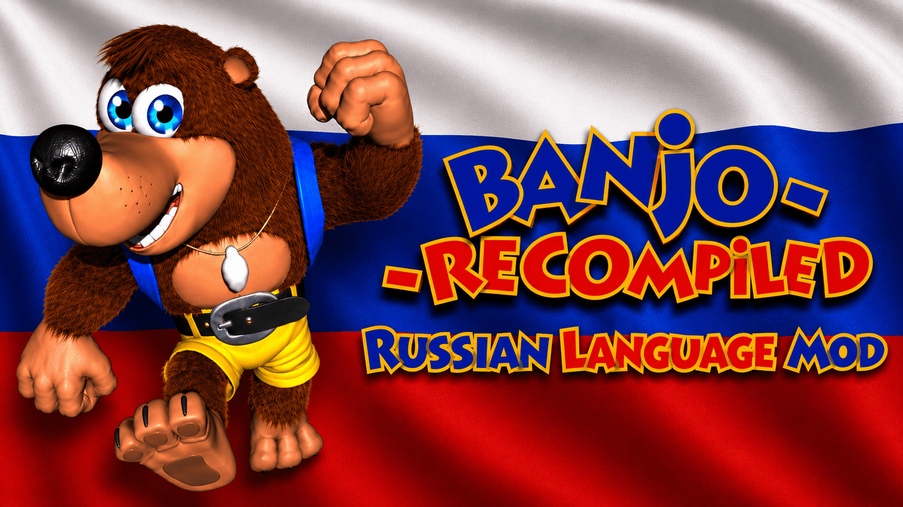
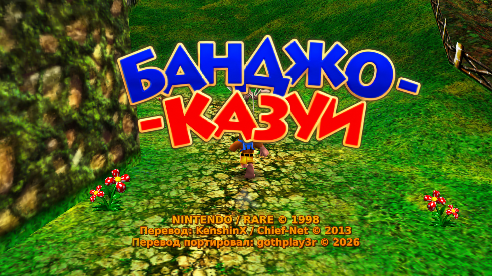
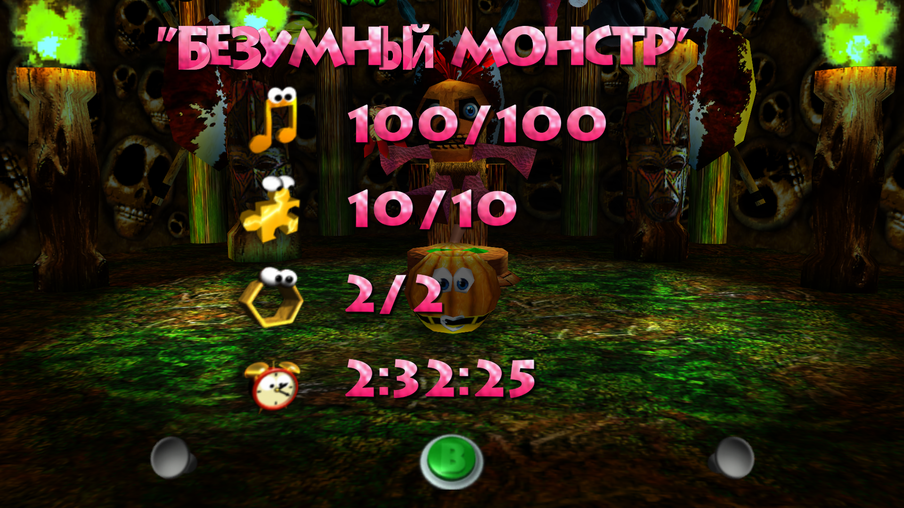
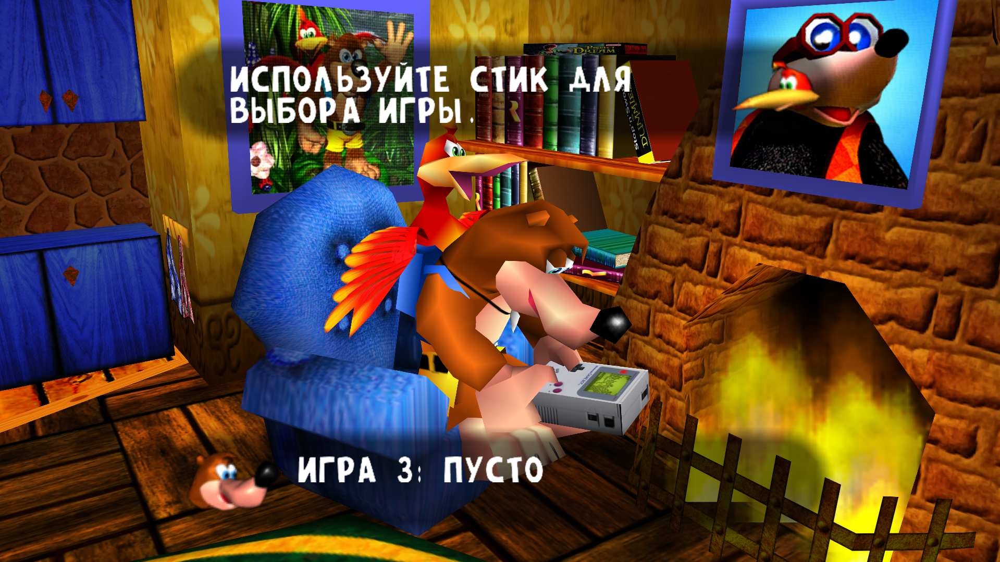
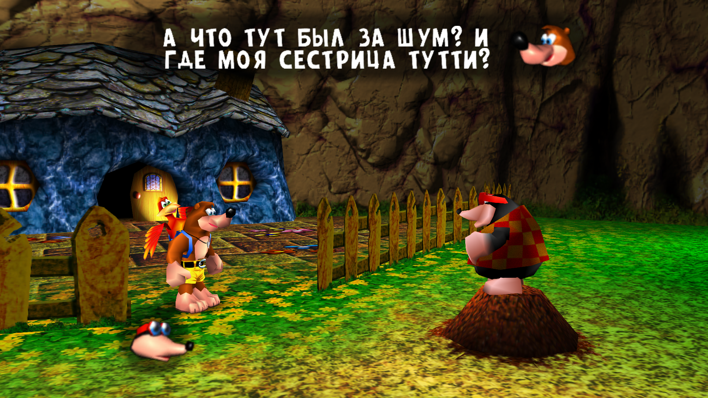
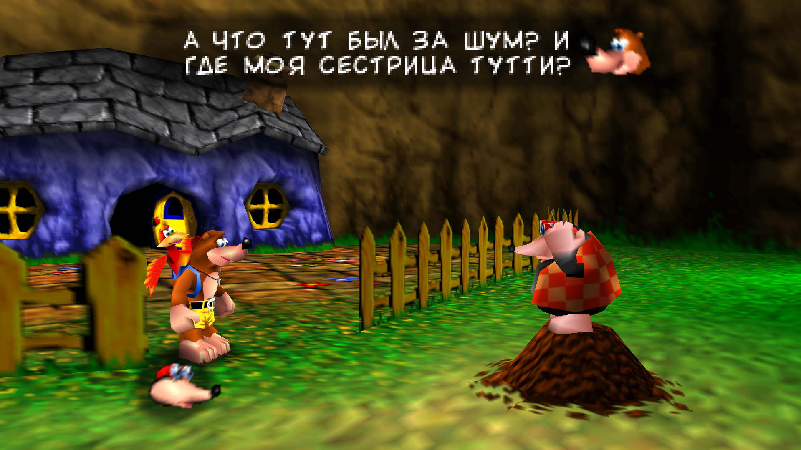

# Russian Language Mod

Порт русской фанатской локализации Banjo-Kazooie для Banjo: Recompiled.
Оригинальная русская локализация была создана KenshinX / Chief-Net © 2013

* Требуется Asset Expansion Pak.
* Полная перекодировка русской локализации с PAL на NTSC-U.
* Доступны два варианта шрифта: HD и Classic. По умолчанию включён HD. Чтобы выбрать Classic, откройте меню Configure.
* Для HD-варианта также рекомендуется использовать сторонние паки HD текстур, например BKHD Loulof.
* Весь системный текст был воссоздан с нуля на основе оригинальной русской локализации, так как напрямую перенести его было невозможно. Текст полностью на русском языке и тщательно проверен.
* Чтобы избежать вылетов, текстура викторины была оставлена на английском, а один из вопросов был сделан статичным.
* Это первый публичный релиз, поэтому возможны ошибки. Однако большинство критических багов уже успешно исправлено, и игра полностью проходима.

## Скриншоты

